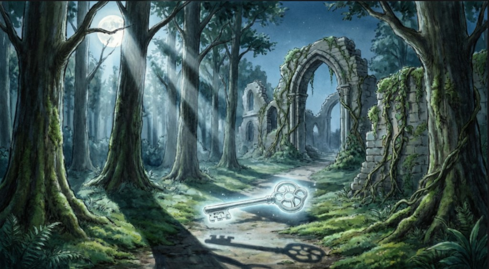

# 📖 Гарри Поттер и Тени Министерства

<p align="center">
  
</p>

> **Визуальная новелла** о заговоре, скрытой правде и ключе, который открывает не дверь — а память.

---

## 🎮 Как играть

1. **Читай текст** — каждая сцена показывает историю и реплики персонажей.
2. **Выбирай действия** — нажимай на кнопки с вариантами, чтобы влиять на сюжет.
3. **Исследуй ветки** — твои решения ведут к разным концовкам (более 20 вариантов).
4. **Настраивай интерфейс** — в меню «Настройки» можно изменить цвет и размер текста, прозрачность фона.
5. **Возвращайся в меню** — кнопка «В меню» или «Перезапустить игру» внизу экрана.

---

## 📥 Установка и запуск

### Требования

- **Java 8** или выше (JRE или JDK)

### Windows

1. Скачай и установи [Java](https://www.java.com/ru/download/).
2. Скачай архив проекта и распакуй в папку.
3. Открой командную строку (Win + R → `cmd` → Enter).
4. Перейди в папку проекта:
   ```bash
   cd путь\к\проекту
   ```
5. Собери и запусти:
   ```bash
   javac -d out/production/project src/*.java
   java -cp out/production/project Main
   ```

### macOS / Linux

1. Установи Java (если ещё не установлена):
   - **macOS:** `brew install openjdk`
   - **Ubuntu/Debian:** `sudo apt install default-jdk`
   - **Fedora:** `sudo dnf install java-latest-openjdk`
2. Скачай и распакуй проект.
3. Открой терминал и перейди в папку проекта:
   ```bash
   cd путь/к/проекту
   ```
4. Собери и запусти:
   ```bash
   mkdir -p out/production/project
   javac -d out/production/project src/*.java
   java -cp out/production/project Main
   ```

### Быстрый запуск (если есть zsh)

```bash
./running_script.zsh
```

---

## 📱 На каких устройствах работает

| Платформа | Поддержка |
|-----------|-----------|
| Windows   | ✅ Полная |
| macOS     | ✅ Полная |
| Linux     | ✅ Полная |
| Android   | ❌ Нет (нужен Java + Swing) |
| iOS       | ❌ Нет   |

Игра предназначена для **настольных компьютеров и ноутбуков** с установленной Java.

---

## 🖼️ Структура проекта

```
project/
├── src/           # Исходный код (Java)
├── images/        # Фоны и иллюстрации для сцен
├── README.md      # Этот файл
└── running_script.zsh
```

---

## 🌙 О проекте

Новелла «Гарри Поттер и Тени Министерства» — интерактивная история с несколькими сюжетными линиями: от поезда до Хогвартса, от руин в лесу до подземелий Министерства. Твои выборы определяют концовку.
